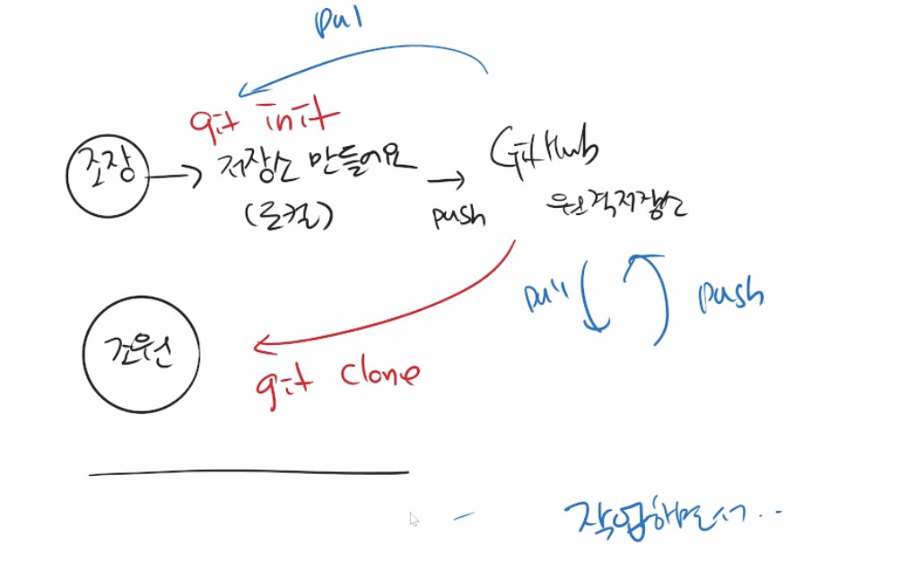

# #git clone, pull
- 명령어
    ```bash
    $ git clone url 
    $ git pull origin master

- pull은 커밋을 받아오는 것이고, clone은 저장소를 가져오는 것이다. 
    github에서 zip 파일을 통해 폴더를 가져왔다면 이후의 커밋을 깃을 통해 가져올 수 없다. 
    
- 

## Git Flow

- Git을 활용하여 협업하는 흐름으로 branch를 활용하는 전략을 의미한다.

  | branch                        | 특징                                                         | 예시                                               |
  | ----------------------------- | ------------------------------------------------------------ | -------------------------------------------------- |
  | Master(main)                  | 배포 가능한 상태의 코드                                      | LOL 클라이언트 라이브 버전                         |
  | Develop (main)                | Feature branch로 나뉘어지거나, 발생된 버그 수정 등 개발 진행. 개발 후 release branch로 갈라짐. | 다음 패치를 위한 개발                              |
  | feature branches(supporting)  | 기능별 개발 브랜치(topic branch). 기능이 반영되거나 드랍되는 경우 브랜치 삭제 | 개발시 기능별 예) 신규침피언 세나, 드래곤 업데이트 |
  | release branches (supporting) | 개발 완료 이후 QA/Test 등을 통해 얻어진 다음 배포 전 minor bug fix 등 반영 | 9.24a, 9.24b                                       |
  | Hot fixes(supporting)         | 긴급하게 반영 해야하는 bug fix. release branch는 다음 버전을 위한 것이라면, hotfix branch는 현재 버전을 위한 것. | 긴급 패치를 위한 작업                              |


&emsp; 🐝 Git Flow는 일련의 작업 체계이다. 정해진 답이 있는게 아니고 각각의 환경에서 변형해서 활용하면 된다.<br> 

### branch
- 명령어

  ```bash
  # branch name == A
(master) $ git branch A    # 브랜치 생성
(master) $ git branch    # 브랜치 확인
(master) $ git checkout A    # 브랜치 이동
(master) $ git checkout -b A    # 생성과 이동을 한번에
<br>
(master) $ git branch merge A    # 서로 다른 브랜치에서 만든 커밋 병합(마스터 기준)
(master) $ git branch -d A    # 브랜치 삭제

- branch merge_상황별로
	1. fast-forward :   하나의 브랜치에서만 커밋이 쌓여서, master 브랜치에 그대로 이어붙이면 되는 경우다. 그냥 merge 된다.
	2. merge commit : 서로 다른 커밋이 쌓여 있는 경우에는 두 가지 상황이 있다.
		1. 다른 파일이 수정되어 있는 상황 :   git에서 자동으로 새로운 커밋(merge commit)을 만들어 연결한다. 
		2. 같은 파일이 수정되어 있는 상황 :   git에서 conflict가 발생한 파일을 표시해준다. 사용자가 직접 수정하고 다시 커밋하면 된다. <br>

## GitHub Flow
- Github Flow 기본 원칙
  1. there's only one rule:   anything in the master branch is always deployable
  2. your branch name should be descriptive, so that others can see what is being worked on.
  3. commit messages are important. by writing cleaer commit messages, you can make it easier for other people to follow along and provide feedback
  4. Pull Requests are useful for contributing to open source projects and for managing changes to shared repositories.
  5. now that your changes have been verified in production, it is time to merge your code into the master branch
  <br>
  
- 저장소의 소유권이 있냐 없냐에 따라 workflow를 구분한다.
	1. Feature Branch Workflow (소유권 있음) 
	
  2. Forking Workflow(소유권 없음) 
     
  
    🐝 1,2번 모두 pull request를 수행해야 하는데, 차이점은 2번은 push를 자신의 레포를 통해야 한다는 것 같다.
  
    👀  feature branch가 원격저장소에서 merge를 할 수 있을까?
           feature branch가 master의 이름으로 push를 하면 어떻게 될까?
	<br>
---

출처

- https://nvie.com/posts/a-successful-git-branching-model/
- https://www.notion.so/KDT1-0605edc1e7844ec4913b51cb6bae2b52