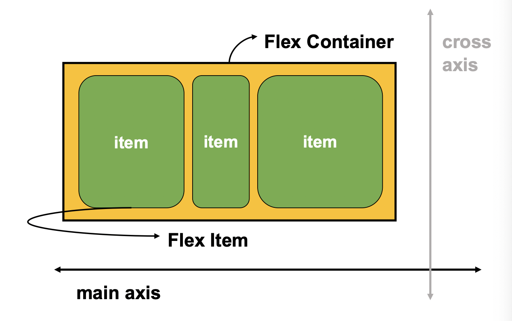

## CSS position
- 문서 상에서 요소의 위치를 지정
- static: 모든 태그의 기본값(기준 위치)
  - 일반적인 요소의 배치 순서에 따름
  - 부모 요소 내에서 배치될 때는 부모 요소의 위치를 기준으로 배치됨

---
1. reletive 

     - 자기 자신의 static 위치를 기준으로 이동 (normal flow 유지)

     - 레이아웃에서 요소가 차지하는 공간은 static일 때와 같음(normal position 대비 offset)

2. absolute

     - 요소를 일반적인 문서 흐름에서 제거 후 레이아웃에 공간을 차지하지 않음(normal flow에서 벗어남)

     - static이 아닌 가장 가까이 있는 부모/조상 요소를 기준으로 이동 (없는 경우 브라우저 화면 기준으로 이동)

3. fixed 

     - 요소를 일반적인 문서 흐름에서 제어 후 레이아웃에 공간을 차지하지 않음(normal flow에서 벗어남)

     - 부모 요소와 관계없이 viewport를 기준으로 이동

4. sticky : 스크롤에 따라 static ->fixed

     - 속성을 적용한 박스는 평소에 문서 안에서 position: static 상태와 같이 일반적인 흐름에 따르지만, 스크롤 위치가 임계점에 이르면 position: fixed와 같이 박스를 화면에 고정할 수 있는 속성. 

     - 일반적으로 navigation bar에서 사용됨


```html
.relative{
  position: relative;
  top: 100px;
  left: 100px;
}
.absolute{
  position: absolute;
  top: 50px;
  left: 50px;
}
.fixed{
  position: fixed;
  bottom: 0;
  right: 0;
}
```
## CSS 원칙
1. 모든 요소는 박스모델, 좌측 상단에 배치
2. display에 따라 크기와 배치가 달라짐
3. position으로 위치의 기준을 변경

## CSS layout
- techniques
  - display
  - position
  - float(CSS1, 1996)
  - flexbox(2012)
  - grid(2017)

- float
  - 박스를 왼쪽 혹은 오른쪽으로 이동시켜 텍스트를 포함 인라인 요소들이 주변을 wrapping하도록 함. 
  - 요소가 normal flow를 벗어나도록 함

## Flexbox
- 행과 열의 형태로 아이템을 배치하는 1차원 레이아웃 모델
- 축 
- 구성 요소
  - flex container(부모 요소)
    - flexbox 레이아웃을 형성하는 가장 기본적인 모델
    - flex item들이 놓여 있는 영역
    - display 속성을 flex 혹은 inline-flex로 지정
  - flex item(자식 요소) - 지정 안함. 
- flex-direction: row

- flex box를 사용하는 이유?
  - 이전까지 normal flow를 벗어나는 수단은 float, position이었다. 이 방법들은 수작업으로 값을 부여하지 않으면 1. 수직 정렬과 2. 아이템의 너비와 높이, 간격을 동일하게 배치하기가 어려웠다. 

## Flex 속성
-  배치
  - flex-direction : main axis 기준 방향
    - row, row-reverse, column, column-reverse
  - flex-wrap : 아이템이 컨테이너를 벗어나는 경우 해당 영역 내에 배치되도록 설정
    - wrap: 밑으로 쌓음
    - nowrap: 아이템 크기를 줄임
  - flex-flow : 위 두개의 shorthand
  
-  공간 나누기
  - justify-content(main axis)
  - align-content(cross axis)
    - align-content는 여러 줄들 사이의 간격을 지정한다. 한 줄만 있을 시에는 작동하지 않는다. 
  
-  정렬
  - align-items(모든 아이템을 cross axis 기준으로)
  - align-self(개별 아이템)
  
-  기타 속성
   - Flex-grow : 남은 영역을 비율로 분배
   
   - Order: 배치 순서(order 있는 것 중에서)
   
     ```html
     <div class="flex_item grow-1 order-3">1
     </div>
     ```
   
     

---
강의자료
[web.dev](https://web.dev/learn/css/flexbox/) --> css 공부하는 추천 사이트
